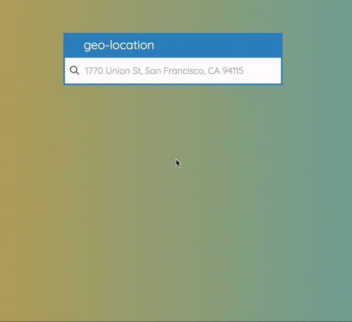

# geo-location
## What is geo-location?
 > Returns the address of the geographically closest store from the dataset based upon input location
 
 
 
## Table of Contents

* [geo-location](#geo-location)
* [Technology Stack](#technology-stack)
* [Installation](#installation)
* [Operation](#operation)
* [Testing](#testing)
* [APIs used](#apis-used)
* [Challenge README](#challenge-readme)

## Technology Stack

 * Node/Express
 * React
 * Bootstrap
 * Mocha/Chai

## Installation

#### Environment dependencies

Set environment variables:
* [APIs used](#apis-used)
```sh
# open the following file
nano ~/.bash_profile
# add the following lines of code to set environment variables
# activate the API and get an API key (get API key from docs referenced in APIs used)
export MAPS_KEY=<insertKey>
export PORT='8080'
# force session to read file
source ~/.bash_profile
```

#### Clone project
Clone repo from github:
```sh
# run git clone
git clone https://github.com/juliusbuckley/geo-location.git
```

#### Project dependencies

Install project dependencies:
```sh
# run install script
npm install
```

## Operation

#### Local development

Install nodemon for dev environment:
```sh
# install nodemon globally 
npm install -g nodemon
```

Start server and transpile with babel-cli:
```sh
# run dev start script
npm run dev:start
```
#### Production

Transpile server folder and start app: 
```sh
# run prod start script
npm start
```

## Searching for nearest store
To search for the nearest store just start typing your current location and the input box will update.

After typing  in the location press the enter button.

The closest store will appear on a google map along with its address and distance.

## Testing 

### Route testing (Must run npm start before testing to build server-dist dir)

Confirm api is working properly and returing Status Code 200

Start server for testing (Make sure server is not running prior to test): 
```sh
# run test script
npm test
```

## APIs used
> Documentation for:
[Google -- Geocoding API](https://developers.google.com/maps/documentation/geocoding/start "Google -- Geocoding API")

> Documentation for:
[Google -- Static Maps API](https://developers.google.com/maps/documentation/static-maps/intro "Google -- Static Maps API")

# Challenge README


# Coding challenge

In this repo there is store-locations.csv

This is a tabular dataset of the locations of every store of a major national retail chain.

# Deliverables

Please download the file (rather than forking this repo) and, do the exercise, and then upload to your own repo.

Then, write a script or application that, given a reasonably well-formed address string like:

1770 Union St, San Francisco, CA 94115

Returns the address of the geographically closest store from the dataset.

Also please write up a paragraph or two about how your solution works, any assumptions you made, or caveats about your implementation, and put it in this readme file.

Send me a github link to the final project.

# Notes

Feel free to do this in whatever language you would like, and focus on the problem itself; the way data gets input into the program is not important. Command line, GUI application, or even editing an obvious variable at the top of a file. Whatever. As long as it's reasonably easy for me to run your code and there are clear instructions for doing so.

You might need to use external APIs or services to get a working solution. That's fine. Also fine to make it work entirely offline. To the extent you need any algorithms, I'm obviously not expecting you to reinvent anything from scratch, so use Google judiciously, as well as any libraries you find.

If you do add cool polish or go above an beyond in some way, feel free, but *by far the most important thing is delivering working software that solves the problem of finding the closest location of this store*.

I know which one is closest to my house, and the first thing I'll do is verify that it returns the address I expect.

I'm hoping this will take well under 2 hours; I did it in a language I know well and (with about 12 tabs open and tons of google searching) got a rough implementation working very quickly.

There are a ton of different ways to do this -- be creative!
